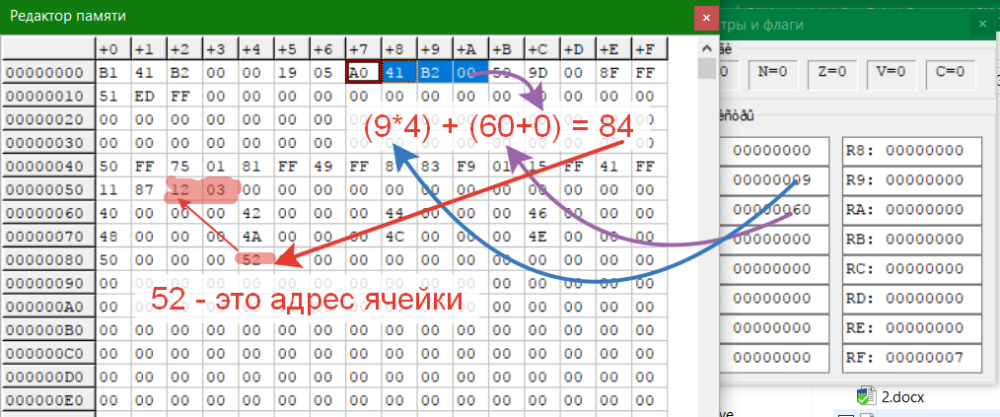

# Индексная адресация адресация: 4
Не использовать с:
* [Литеральной и непосредственную](../8F)
* [С прямой регистровой](../5X)
### Пример 1
В примере для задачи базового адреса используется [B2](../B-D-F)

1. R1 = 9
2. R2 = 60
3. R1 * На размер базы = 916 * 416 = 2416
4. B2 = 60 + 0 (смещение)
5. Теперь мы должны сложить его с [B2](../B-D-F) = 2416 + 6016 = 8416
6. Так как адрессация [B ->[]-[]](../B-D-F) двойная, то 84 это адрес ячейки
7. Переходим по адресу 84 в этой ячейке, тоже лежит адрес указывающий на ячейку 52
8. Переходим в 52 здесь лежит наше значение = 31216
9. Следовательно после операции R0 = 0 + 31216