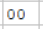

### Адресация Ax, Cx, Ex
Где x = номер регистра
* A = Byte = 1 Байт = 8 разрядов = 
* C = Word = 2 Байта = 16 разрядов  = 
* E = LongWord = 4 Байта = 32 разряда  = 

В этом режиме адрес операнда определяется суммой  содержимого ис-пользуемого регистра и смещения.  Значение смещения хранится в дополнительном коде непосредственно в поле операнда 

# Пример
Рассмотрим EF (LongWord) 
Нужно определить сначала Адресс, в котором мы окажемся после прочтения операнда.
- Адресс ячейки EF + 4 байта (Потому что LongWord). 
- Следовательно Следющий КОП будет объявлен в адресе 8.

**Значение Операнда для EF = Адрес - Адрес следующего КОП**
- Адрес = BB
- Следуюший адрес КОП = 8
