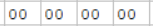

# Относительная адресация: Ax, Cx, Ex ->[]
Где x = номер регистра

A, C, E -> [ ] , Содержит ячейку, ссылающуюся на значение, похоже на [6 адресацию](../6X)
* A = Byte = 1 Байт = 8 разрядов = 
* C = Word = 2 Байта = 16 разрядов  = 
* E = LongWord = 4 Байта = 32 разряда  = 

**В этом режиме _адрес_ операнда = регистр + смещение.** 
Значение смещения хранится в дополнительном коде непосредственно в поле операнда 

### Пример 1
* Рассмотрим EF = LongWord
* Адрес следущей операции (Будущее значение RF) = 8
* Смещение = B3
* B3 + 8 = BB
* Ячейка BB содержит значение

 ### Пример 2
 // Смотрим синии линии
 * A0 = 0 регистр = Byte
 * 00 = Смещение
 * R0 = CB
 * CB + 00 = CB
 * Ячейка CB содержит значение
 
 