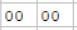
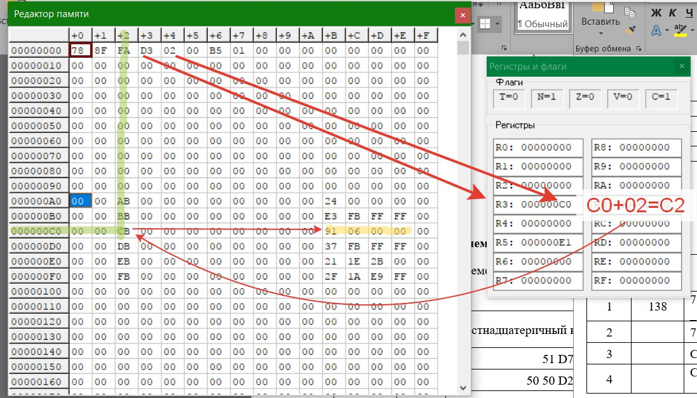

### Косвенная Относительная Адресация Bx, Dx, Fx -> [ ] -> [ ]
Где x = номер регистра

B, D, F -> [ ] -> [ ], Содержит ячейку, ссылающуюся на ссылку значения
* B = Byte = 1 Байт = 8 разрядов = 
* D = Word = 2 Байта = 16 разрядов  = 
* F = LongWord = 4 Байта = 32 разряда  = 

**В этом режиме _адрес адреса_ операнда = регистр + смещение.** 

 #### Пример 1
 * D3 = 3 регистр = Word
 * 00 02 = Смещение
 * Значение 3-го реистра = С0
 * С0 + 2 = С2
 * Ячейка С2 содержит адрес 
 
 
 
#### Пример 2
 * F2 = 2 регистр = LongWord
 * 00 00 00 08 = Смещение
 * Значение 2-го регистра = 3E
 * 3E + 8 = 46
 * Ячейка 46 содержит адрес 
 
 
 #### Пример 2
 * BF = F регистр = Byte
 * 3c = Смещение
 * Адрес следущей операции (Будущее значение RF) = 23
 * 3C + 23 = 5F
 * Ячейка 5F содержит адрес 
 