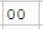
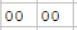
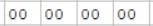
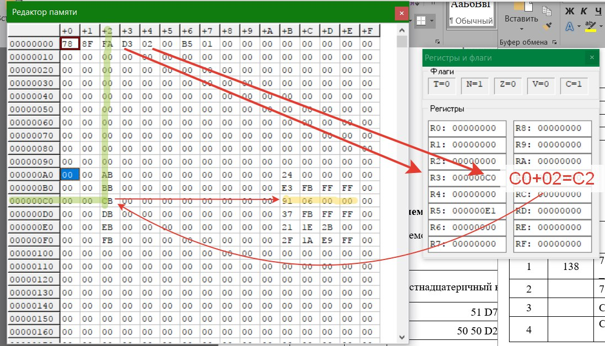

# ArchPC-SUAI
Помощь по Архитектуре ЭВМ в ГУАП

### [Cкрипт](src/1.py) для помощи в 1 лабе
1. Задаете Номер варианта (V)
2. Задаете Номер группы (G)

### Адресация Bx, Dx, Fx
Где x = номер регистра
* B = Byte = 1 Байт = 8 разрядов = 
* D = Word = 2 Байта = 16 разрядов  = 
* F = LongWord = 4 Байта = 32 разряда  = 

 **Значение регистра + смещение = адрес, в котором хранится адрес значение.**
 
 #### Пример 1
 * D3 = 3 регистр = Word
 * 00 02 = Смещение
 
 
 
  #### Пример 2
 * F2 = 2 регистр = LongWord
 * 00 00 00 08 = Смещение
 
 