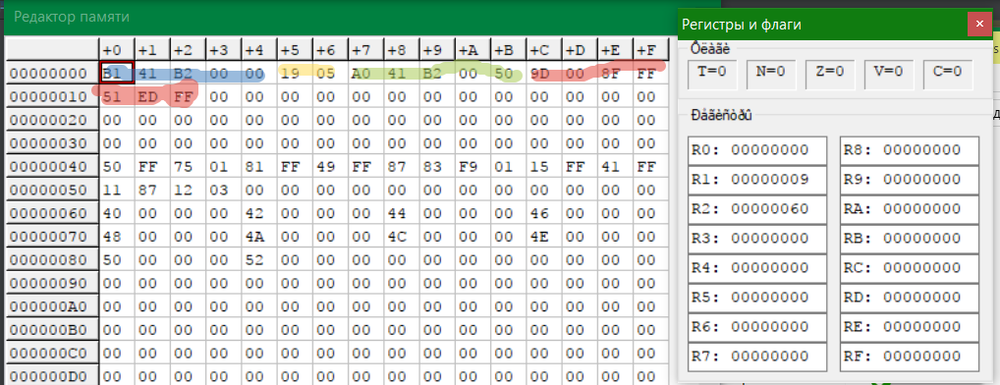
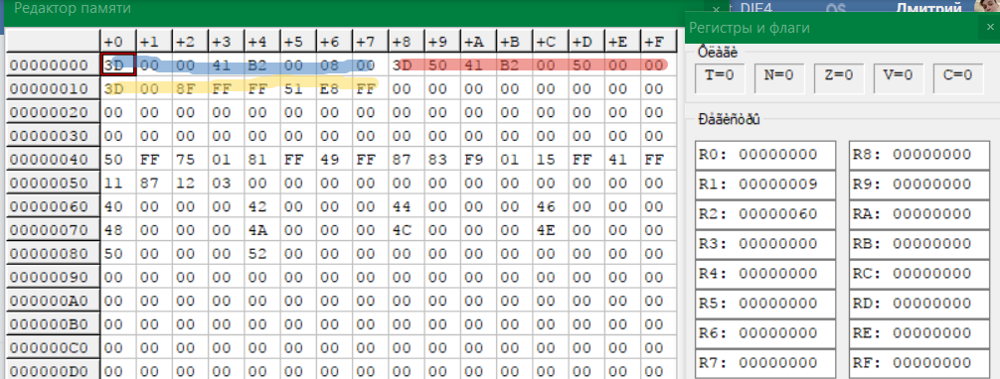

# Краткий F.A.Q. по командам VAX-11

## ACB: Изменение, сравнение, переход
```C
ACB (x,y,z,j){
    z = y+z
    if (y>=0 & z<=x) | (y<0 & z>=x)
        JMP J
}
```
### Пример использования
#### [Стандартное](../vax/2.2.V4.G6.v11) использование ACB
В задаче: "Найти сумму положительный членов массива"

|  № |  КОП | МНЕМО  |  Пояснения |
|:---:|:---:|:---:|:---:|
| 1 | B1 41 B2 00 00  | CMPW R1 0  |  if A[i]>0 goto 3 |
| 2 | 19 05  | BLSS 5  | else goto 4  |
| 3 | A0 41 B2 00 50  | ADDW2 R1 R2  | R0+=A[i]  |
| 4 | 9D 00 8F FF 51  ED FF |  ACB  #0, #-1, i, -13 | i -= 1  <br> if (-1<0) & (i>=0) <br> goto 1 |
| 5 | 00  |  HALT | |



#### [Нестандартное](../vax/2.2.1.V4.G6.v11) использование ACB
В задаче: "Найти сумму положительный членов массива"

|  № |  КОП | МНЕМО  |  Пояснения |
|:---:|:---:|:---:|:---:|
| 1 |3D 00 00 41 B2 00 08 00  | ACB 0 0 A[i] 8 |  if A[i] < 0 goto 3 |
| 2 | 3D 50 41 B2 00 50 00 00  | ACB R0 A[i] R0 0 | R0+=A[i]  |
| 3 | 3D 00 8F FF FF 51 E8 FF  | ACB 0 -1 i -24  |  i-- <br> if i!=0 goto 1 |
| 4 | 00  |  HALT | |

* Что происходит в ШАГЕ 1? 
**СРАВНЕНИЕ**
```C
ACB(0, 0, A[i]){
    z = 0 + A[i]
    if(0>=0 & z<=0)
        goto ШАГ 3
    else goto ШАГ 2
}
```
* Что происходит в ШАГЕ 2? 
**ИЗМЕНЕНИЕ**
```C
ACB(SUM, A[i], SUM){
    SUM = A[i] + SUM
    // Условие выполняется ВСЕГДА
    if(A[i]>=0 & SUM<=SUM) | (A[i]<0 & SUM>=SUM)
        goto ШАГ 3
    else goto ШАГ 3
}
```
* Что происходит в ШАГЕ 3? 
**ПЕРЕХОД**
```C
ACB(0, -1, i){
    i = -1 + i
    if (-1<0) & (i>=0)
        goto ШАГ 1
    else HALT;
}
```
